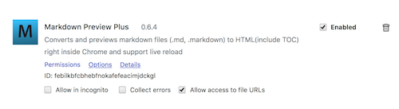
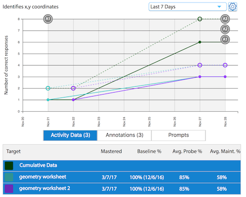

## V1.0 LiftEd Graphing Engine
###### Created by Yong Park
###### Copyright © 2017 LiftEd, Inc. All rights reserved.

###### For help email:  <Support@LiftingEduction.co>

### About this package:

The LiftEd Graphing Package is a JavaScript graphing package that provides an API over the D3.js graphing library to provide a simple way to produce rich graphs of educational data.

Please pull the latest branch from origin/release/SDK-V1.

To view this README please open in a markdown-capable editor such as [Atom](https://atom.io/) or use a viewer such as the the [Markdown Preview Plus](https://chrome.google.com/webstore/detail/markdown-preview-plus/febilkbfcbhebfnokafefeacimjdckgl) Chrome extension -- make sure you turn on "Allow access to file URLs" in Chrome's extension page [chrome://extensions](chrome://extensions).




### Features:

- [x] Graphs data in integers, percentage, or duration.
- [x] Allows the user to create maximum allowed/value correct lines + cumulative lines if more than 1 data target is provided.
- [x] Clickable data points to pass relevant information regarding the data point to a modal.
- [x] Graphs prompts in a bar chart below the main graph.
- [x] Allows for custom date selection and preselected date ranges.
- [x] Switches between integer/percentage & behavior/duration graphs without a graph load.
- [x] Saves relevant user information (date range selection and tab selection) for next graph load.
- [x] Prebuilt callbacks for easy integration with iOS.
- [x] Tactics lines, notes and annotations are available for use.
- [x] Annotations can be created and edited on the graph.
- [x] Notes and tactics are viewable in a modal by clicking the tactic/note bad or clicking the line in the tactic/note section below.


### Licenses:
Please contact <Support@LiftingEduction.co> to obtain a license to use this package.  The licenses for all third party utilities used in the package can be found in: [Licenses.md](Licenses.md).


### Demo:
Load [Demo/LECPGraphingIndexDemo.html](Demo/LECPGraphingIndexDemo.html) in a webkit-based browser (Safari or Chrome) and select a date range from the dropdown.




### Usage:

This package can be used anywhere you have a Javascript-enabled HTML rendering engine, such as a web browser, or in an app such as an iOS app with an embedded WebView.  


The Package contains the following directories:
 + Graphing: This is the main graphing package that you will be integrating into your project
 + Templates: : This directory contains a templates for LECPGraphingCallbacks and LECPUtilsCallbacks. Please copy the files over to the Graphing Folder to start integrating.
 + Specifications: This directory contains the documentation for each function used inside the LiftEd Graphing Engine, the data model used to load the graph, and an example JSON of the data structure.
 + Demo: This holds a self-contined demonstration of the package, just open the html file in a browser and the select a date range to see the demo.
 + Screenshots: This directory contains screenshots used for this readme.
 + Tools: This contains a bash script for copying all the directories into the integration destination.


### Documentation:

 * [Index](Specifications/index.html)
 * [API](Specifications/API.html)
 * [Const](Specifications/Const.html)
 * [Graphing](Specifications/Graphing.html)
 * [GraphingCallbacks](Specifications/GraphingCallbacks.html)
 * [UtilsCallbacks](Specifications/UtilsCallbacks.html)
 * [Vars](Specifications/Vars.html)
 * [Data Structure](Specifications/GraphSpecs.md)
 * [Sample JSON](Specifications/ComputedJSONStructure.json)

### Integration:

There are two sets of APIs:
 + Package APIs: javascript functions you can call to show/update a graph, to see the full list of APIs view the documentation:  [API Documentation](Specifications/API.html)
 * APIs are located inside of the Graphing directory ([LECPAPI](Graphing/LECPAPI.js)).

 + Callback APIs:  javascript functions you need to implement handlers for that do things such as report errors or ask for specific data to display for a given data point. The Callback APIs are split into two different files:
   + [LECPGraphingCallbacks](Templates/LECPGraphingCallbacks.js): these are for Graphing related callbacks
   + [LECPUtilsCallbacks](Templates/LECPUtilsCallbacks.js): for Utility Callbacks.

 * Specs: Specifications for the data structure are located inside the Specifications directory:
   * [Data Structure](Specifications/GraphSpecs.md)


*The rest of these instructions are written assuming you are integrating into an iOS app with a WKWebView using Objective-C, but the process is similar for other deployment environments.*

*If you'd like help with your integration, please email: <Support@LiftingEduction.co>*


#### iOS Integration: Step 1 - Copy the Callback Template files to the /Graphing folder:

1. Copy [Templates/LECPGraphingCallbacks.js](Templates/LECPGraphingCallbacks.js) from /Templates into /Graphing

2. Copy [Templates/LECPUtilsCallbacks.js](Templates/LECPUtilsCallbacks.js) from /Templates to /Graphing


#### iOS Integration: Step 2 - Add /Graphing directory to the build:

Add the /Graphing subdirectory to your project, making sure to include the template files you just copied over from the Templates directory.


#### iOS Integration: Step 3 - Update the Callbacks template files:

There is a placeholder "window.alert()" inside of each callback function in the LECPGraphingCallbacks.js and LECPUtilsCallbacks.js.  You need to update those for your integration.

In iOS with an embedded WKWebView you can do this by:
  + Add a line like this for each callback in your viewDidLoad():

```
[self.WKWebView.configuration.userContentController addScriptMessageHandler:self name:@"LECallbackFUpdateGraph"];
```

  + Add the following to create a WKWebView didReceiveScriptMessage handler, then add code to handle each callback:

```
-(void)userContentController:(WKUserContentController *)userContentController didReceiveScriptMessage:(WKScriptMessage *)message {
  if ([message.name isEqualToString:@"fShowDetailsFor"]) {
    //do work for fShowDetailsFor() callback here
  }
  else if ([message.name isEqualToString:@"LECallbackFUpdateGraphDefaults"]) {
    //do work for LECallbackFUpdateGraphDefaults callback here
  }
  // continue with else if statements for each of the callbacks...
}
```


#### iOS Integration: Step 4 - Load the Graphing package:

Use the following code to load the main HTML that will trigger the graphing package:

```
NSString *vStrPathHTMLInitial = [[NSBundle mainBundle] pathForResource:@"LECPGraphingIndex" ofType:@"html"];
NSURL* vURLHTMLInitial = [NSURL fileURLWithPath:vStrPathHTMLInitial isDirectory:NO];

[self.WKWebView loadFileURL:vURLHTMLInitial allowingReadAccessToURL:vURLHTMLInitial];
```


#### iOS Integration: Step 5 - update the graph with data:

Generate your data JSON according to the specification:  [GraphSpecs](Specifications/GraphSpecs.md) (located in Specifications folder)

Then call the window.LiftEd.API.fShowGraphWithJSON API using code similar to this:

```
//NSString* vDataJSONAsString = the string of the JSON of the DATA in the format defined in the specification

NSString* vJSString = [NSString stringWithFormat:@"window.LiftEd.API.fShowGraphWithJSON(%@);", vDataJSONAsString];

[vWKWebView evaluateJavaScript:vJSInitDebug
             completionHandler:^(id result, NSError *error)
 {
   //Code to execute after the JS returns with "result"
 }
 ];


```


### List of Callbacks and their Usage:

Below is a description of each callback inside the two files copied from Templates, [LECPGraphingCallbacks](Graphing/LECPGraphingCallbacks.js) and [LECPUtilsCallbacks](Graphing/LECPUtilsCallbacks.js), with information about its functionality, data structure, and which API function inside [LECPAPI](Graphing/LECPAPI.js) (located in Graphing directory) those callbacks should themselves call back into the package to apply changes to the graph.


#### LECPGraphingCallbacks.js:
###### LECPGraphingCallbacks.js: [fDidLoadGraph()](Specifications/GraphingCallbacks.html)
fDidLoadGraph is a function called by the graph when the graph is done loading.
To integrate with iOS, add a callback to iOS inside window.LiftEd.GraphingCallbacks.fDidLoadGraph (located in Graphing/[LECPGraphingCallbacks](Graphing/LECPGraphingCallbacks.js)) to indicate the graph is finished loading and to allow user interaction with the graph (take away the spinner started in window.LiftEd.Callbacks.fStartSpinner). This callback will take string version number as an argument, aStrVersionNumber.

###### LECPGraphingCallbacks.js: [fUpdateGraph()](Specifications/GraphingCallbacks.html)
fUpdateGraph is a function called when the when the user loads a new graph.
To integrate with iOS, add a callback to iOS inside window.LiftEd.GraphingCallbacks.fUpdateGraph (located in Graphing/[LECPGraphingCallbacks](Graphing/LECPGraphingCallbacks.js)) that takes the following dictionary format.

```
{
  typeDate: 0,1,2,3,4,5,6,99 (integer)
  dateStart: unixdate,
  dateEnd: unixdate,
  uuid: string,
  options: {
    typeChart: 0,1 (integer)
    typeDisplay: 0,1,2,3 (integer)
    numberHandler: 0,1,2 (integer)
    tabOnLoad: 0,1,2,3 (integer)
  }
};
```

###### LECPGraphingCallbacks.js: [fUpdateGraphDefaults()](Specifications/GraphingCallbacks.html)
fUpdateGraphDefaults is function called when the user sets a new default for the options parameter for the next graph load.
To integrate with iOS, add a callback to iOS inside window.LiftEd.GraphingCallbacks.fUpdateGraphDefaults (located in Graphing/[LECPGraphingCallbacks](Graphing/LECPGraphingCallbacks.js)) that takes the following dictionary format.

```
{
  typeDate: 0,1,2,3,4,5,6,99
  dateStart: unixdate,
  dateEnd: unixdate,
  uuid: string,
  options: {
    typeChart: 0,1 (integer)
    typeDisplay: 0,1,2,3 (integer)
    numberHandler: 0,1,2 (integer)
    tabOnLoad: 0,1,2,3 (integer)
  }
};
```

This callback will set the options parameter as the one passed in for the next graph load.

###### LECPGraphingCallbacks.js:  [fCallBackAddAnnotation()](Specifications/GraphingCallbacks.html)
fCallBackAddAnnotation is a function called when the user adds a new annotation or edits an existing annotation to the graph.
To integrate with iOS, add a callback to iOS inside window.LiftEd.GraphingCallbacks.fCallBackAddAnnotation (located in Graphing/[LECPGraphingCallbacks](Graphing/LECPGraphingCallbacks.js)) that takes the following dictionary format and adds the annotation to the database or edits the existing annotation.

```
{
    typeDate: 0,1,2,3,4,5,6,99 (integer)
    dateStart: unixdate,
    dateEnd: unixdate,
    uuid: string,
    options: {
      typeChart: 0,1 (integer)
      typeDisplay: 0,1,2,3 (integer)
      numberHandler: 0,1,2 (integer)
      tabOnLoad: 0,1,2,3 (integer)
    },
    annotations: [
      {
        vDictAnnotation.note = string
        vDictAnnotation.uuid = optional string. only used when editing existing annotation.
        vDictAnnotation.scopeUUID =  string
        vDictAnnotation.scopeType =  0,1,2,3 (integer)
      }
    ]
};
```

The annotations parameter will contain the new annotation or the edited annotation (must have uuid if edited).

To load the graph with the newly added/edited annotation, call window.LiftEd.API.fShowGraph (located inside Graphing/[LECPAPI](Graphing/LECPAPI.js)) with a dictionary containing the data structure located in [GraphSpecs](Specifications/GraphSpecs.md) (located in Specifications folder).

###### LECPGraphingCallbacks.js: [fShowDetailsFor()](Specifications/GraphingCallbacks.html)
fShowDetailsFor is a function called when the user clicks a data point to get its relevant information such as date, proctors, and prompts.
To integrate with iOS, add a callback to iOS inside window.LiftEd.GraphingCallbacks.fShowDetailsFor (located in Graphing/[LECPGraphingCallbacks](Graphing/LECPGraphingCallbacks.js)) that takes the following dictionary format with details about the data point clicked:

```
{
  typeDate: 0,1,2,3,4,5,6,99 (integer)
  dateStart: unixdate,
  dateEnd: unixdate,
  uuid: string,
  options: {
    typeChart: 0,1 (integer)
    typeDisplay: 0,1,2,3 (integer)
    numberHandler: 0,1,2 (integer)
    tabOnLoad: 0,1,2,3 (integer)
  }
};
```

The returning information of the callback will be passed to window.LiftEd.API.fDisplayModalHTML (located inside Graphing/[LECPAPI](Graphing/LECPAPI.js)) as an HTML string in the follow format:

```
<div class="cLEAnnotationModalDate">12-13-2017</div> Date
<div class="cLEAnnotationModalTitle">Geometry Computer Program</div> Title
<div class="cLEAnnotationModalValueType">Activity</div> Activity/Behavior
<div class="cLEAnnotationValueCorrect">Correct: 3</div> Number of correct responses.
<div class="cLEAnnotationModalValueTotal">Total: 10</div> Number of total questions. (Optional)
<div class="cLEAnnotationModalProctors">Jane Doe, Jane Doe</div> Proctors
<div class="cLEAnnotationModalPrompts">Physical, Gestural</div> Prompts
<dl class="cLEValuePointDataList"> Descriptive List
  <dt class="cLEValuePointPromptDT">Prompts</dt> Descriptive List Name
  <dd class="cLEValuePointPromptDD"> X - 14:30 - Geometry Computer Program - Prompts: Gesutral, Physical</dd> Descriptive List Item Individual Prompts used that day.
  <dd class="cLEValuePointPromptDD"> X - 14:30 - Geometry Computer Program - Prompts: Gesutral, Physical</dd> Descriptive List Item Individual Prompts used that day.
  <dd class="cLEValuePointPromptDD"> X - 14:30 - Geometry Computer Program - Prompts: Gesutral, Physical</dd> Descriptive List Item Individual Prompts used that day.
  <dd class="cLEValuePointPromptDD"> X - 14:30 - Geometry Computer Program - Prompts: Gesutral, Physical</dd> Descriptive List Item Individual Prompts used that day.
  <dd class="cLEValuePointPromptDD"> X - 14:30 - Geometry Computer Program - Prompts: Gesutral, Physical</dd> Descriptive List Item Individual Prompts used that day.
  <dd class="cLEValuePointPromptDD"> X - 14:30 - Geometry Computer Program - Prompts: Gesutral, Physical</dd> Descriptive List Item Individual Prompts used that day.
</dl>
```

The string must not have spaces OR line breaks between HTML Elements. Please take out descriptions of each HTML tag (on the right) before sending the string.


The returning information of the callback will then be passed to window.LiftEd.API.fShowGraph (located inside Graphing/[LECPAPI](Graphing/LECPAPI.js)) to load the graph with a dictionary with the data structure located in [GraphSpecs](Specifications/GraphSpecs.md) (located in Specifications folder).

#### LECPUtilsCallbacks.js:
##### LECPUtilsCallbacks.js: [fShowSpinner()](Specifications/UtilsCallbacks.html)
fShowSpinner is a function called to show a spinner on iOS and to disable user interaction with the graph till loading is complete.
To Integrate with iOS, add a callback to iOS inside fShowSpinner (located in Graphing/[LECPUtilsCallbacks](LECPUtilsCallbacks.js)) that creates a spinner and disables user interaction until fHideSpinner is called.

##### LECPUtilsCallbacks.js: [fHideSpinner()](Specifications/UtilsCallbacks.html)
fHideSpinner is a function called to hide the spinner and allow user interaction for the graph.
To integrate with iOS, add a callback to iOS inside window.LiftEd.Callbacks.fHideSpinner (located in Graphing/[LECPUtilsCallbacks](Graphing/LECPUtilsCallbacks.js)) that takes a string version number (aStrVersionNumber) and performs the same action as window.LiftEd.GraphingCallbacks.fDidLoadGraph in [LECPGraphingCallbacks](LECPGraphingCallbacks.js).

##### LECPUtilsCallbacks.js: [fReportErrorToClient()](Specifications/UtilsCallbacks.html)
fReportErrorToClient is a function called to report the error on iOS's alert message box.
To integrate with iOS, add a callback to iOS inside window.LiftEd.Callbacks.fReportErrorToClient (located in Graphing/[LECPUtilsCallbacks](Graphing/LECPUtilsCallbacks.js)) that takes a String Error (aStrError) to display in the alert message box.

##### LECPUtilsCallbacks.js: [fShowAlert()](Specifications/UtilsCallbacks.html)
fShowAlert is a function called to create a customized alert message in iOS's alert message box.
To integrate with iOS, add a callback inside window.LiftEd.Callbacks.fShowAlert (located in Graphing/[LECPUtilsCallbacks](Graphing/LECPUtilsCallbacks.js)) that takes a dictionary in the following format to display in the alert box:

```
{
   "title": "alert title",
   "message": "some message"
}
```

This callback will take the dictionary above and show an alert inside the iOS alert message box with the Title and Message inside the dictionary.
